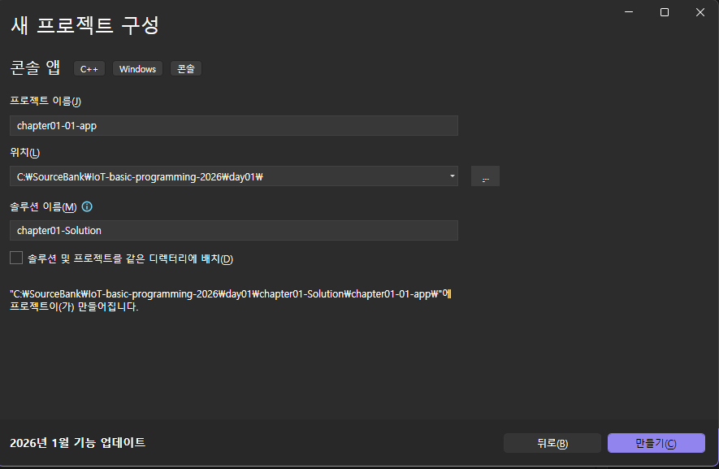
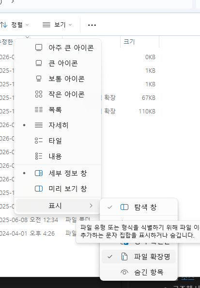

# IoT-basic-programming-2026
IoT 개발자 과정 기초 프로그래밍 언어 학습 리포지토리

## 1일차
-  Git, GitHub Desktop 설치
- Visual Studio Code 설치
- 리드미 미리 보기: Ctrl + Shift + V

### C언어 학습 순서
- 기본
1. 프로그램 기본
2. 상수와 데이터 출력
3. 변수와 데이터 입력
4. 연산자
5. 제어문(분기문, 반복문)
6. 함수
 

- 고급
 7. 배열
 8. 포인터
 9. 배열과 포인터 
 10. 문자열과 포인터
 11. 변수의 영역과 데이터 공유
 12. 다차원 포인터
 13. 구조체 자료형
 14. 파일 입출력
 
 ### 프로그램 개요
 - 프로그램이란 사용자의 요구에 따라 데이터를 처리(표현, 이동,저장,로드)할수 있는 소프트 웨어
 - 프로그램을 만드는 작업: 프로그래밍(코딩,SW개발)

 ###c언어
 - 켄 톰슨과 데니스 리치가 unix 운영 체제를 개발하기 위해서 만든 언어
 - c++,Java, Python등 모든 언어의 기본이 되는 언어
 - 1999년에 표준에 따라서 학습

 ### 컴파일과 컴파일  사용법
- 소스 코드 파일을 컴퓨터가 실행할수 있늗 파일로 변경,생성 할수 있게 해주는것
- c, cpp -> 확장자 exe 파일로 생성
- 컴파일러: IDE(integrity,development,environment)툴을 사용

### visual studio installer 설치

Visual Studio 사용시 주의 사항(solution 안에 project가 있다)

### Visual Studio 설치
1. 새 프로젝트 만들기
2. 소스코드 확장자를 변경
   *.cpp -> c로 변경

### 기본 문법
1. 기본 사용법
   -메인 함수 사용법 

2. 프로젝트가 여러개일때
  - 솔루션 속성 > 시작 프로젝트 구성 > 현재 선택 영역으로 선택

3. 진수별 표현법
   |10진수|0|1|2|3|4|5|6|7|8|9|10|11|12|13|14|15|
   |:---:|:---:|:---:|:---:|:---:|:---:|:---:|:---:|:---:|:---:|:---:|:---:|:---:|:---:|:---:|:---:|:---:|
   |8진수|0|1|2|3|4|5|6|7|10|11|12|13|14|15|16|17|
   |16진수|0|1|2|3|4|5|6|7|8|9|A|B|C|D|E|F|

   ## 2일차
   
   ### C 기본 문법 계속
1. 기본 문법
    -데이터형: [확인](./day02/Chap03-Solution/Chap03-01-app/main.c)
        - 실수형: [확인](./day02/Chap03-Solution/Chap03-02-app/main.c)
        -데이터 입력:[확인](./day02/Chap03-Solution/Chap03-03-app/main.c)
   - 연산     

   ## 3일차
   ### c기본 문법 계속
   1. 제어문 - 선택문/분기문
     -if 문:
     -switch~case문: [확인](/day03/Chap05-Solution/Chap05-02-app/main.c)

   2. 반복문
      -while, do ~while문: [확인](/day03/Chap05-Solution/Chap05-03-app/main.c)

   3.디버깅의 기본   

   ##4일차

   ### C 기본 문법 계속
   1. 함수 계속
    - 함수 유형: [확인](./day03/Chap07-Solution/Chap07-02-app/main.c)
         - 매개 변수가 없는 함수
         - 반환 값이 없는 함수
         - 매개 변수와 반환값이 없는 함수
         - 매개 변수, 반환값이 있는 함수
   - 재귀 호출 함수[확인](./day03/Chap07-Solution/Chap07-03-app/main.c)      
   2. 배열
      -동일 자료형의 묶음 - 'ary[10]'
      - 배열 선언, 초기화: [확인](./day03/Chap08-Solution/Chap08-01-app/Chap08-01-app.vcxproj)
      -문자 배열(문자열)[확인](./day03/Chap08-Solution/Chap08-02-app/main.c)
      - 대소문자 변환: [확인](./day03/Chap08-Solution/Chap08-quiz/main.c)
   3. 포인터
      -   #include <stdio.h>

int main(void)
{
	int a;
	int* pa; // 포인터 변수는 값은 담는것이 아닌 다른 변수의 주소를 담는다.
	pa = &a; // a의 주소를 pa에 저장한다.
	// 포인터가 가리키는 변수에다가 값을 지정한다.
	*pa = 100; 
	// 지금 위에서 a 변수의 주소를 포인터 변수에 저장이 되어 있고 pa에 100을 넣었기 때문에 a의 주소에 100을 넣었기 때문에 a에 100이 들어가 있다.
	printf("a값 출력 : %d\n", a);

	printf("변수 a의 주소: %d\n", &a);
	printf("포인터 변수 pa의 값: %u\n", pa);
}

##5일차
### C기본 문법

1. 포인터
   -포인터 이해
      - 변수의 주소를 답고, 간접참조연산자로 그 변수의 값을 사용하기 위한것
      - 변수의 주소를 변경해서 여러 주소를 사용 가능
      - 변수읮 주소는 바뀌지 않는 값
      

      -포인터 크기
         - 주소의 크기와 동일 - 8byte

      - 포인터 사용 이유
         -용량이 제한된 임베디드 시스템에서 데이터를 공유 하는 목적
            -함부로 변수를 마구 찍어서 만들수 있다
            -주소를 공유 해서  함수 어디서나 변수의 값을 변경 할수 있다

2. 배열과 포인터
   - scanf()배열 str[80]선언후 &str로 사용

3. 문자
   - getchar()를 사용해 입력 버퍼 한글자 지우기

4. 문자열 기본: [확인](/day05/Chap11-Solution/Chap11-02-app/main.c)        

4. 프로그램의 메모리 영역
 - 코드 영역, 스택,힙, 기타 데이터 영역 구분
 - 코드 영역 - 소스 코드가 실행 하는 영역
 - 스택 - 지역 변수 영역
 - 힙 - 동적 할당 영역, pointer,null
 -  기타 데이터 영역 - 전역 변수,static변수 영역
 
 5. 동적 할당 저장 공간 활용
 - 영어 사전과 같은 데이터를 저장 할떄
   - 배열로 처리하면 메모리 낭비가 심함
   - 동적 할당으로 메모리 절약

6. main 함수 명령행 인수 사용
   - int amin(int, argc,char**,argv)가 기본 메인 함수이다
   - 프로젝트 속성에서 명령 인수 입력 방법
7. 사용자 정의 자료형 - 구조체
   - c언어는 절차형 프로그래밍 언어
   - c++ㅇ은 객체 지향 프로그래밍 언어. c#, java,python
   - 객체 지향형 언어        

## 8일차

### c중급 문법
1. 사용자 정의 자료형 - 구조체:[소스](./Day08/Chap17-Solution/Chap17-01-app/main.c)

- 구조체 사용 [소스](./Day08/Chap17-Solution/Chap17-02-app/main.c)
- 구조체 내 구조체[소스](./Day08/Chap17-Solution/Chap17-04-app/main.c)
- 구조체 포인터[소스](./Day08/Chap17-Solution/Chap17-03-app/main.c)
2. 사용자 정의 자료형 - 공용체, 열거형

3. 파일 입출력
   - 파일 종류: 텍스트 파일, 바이너리(2진)파일
   - 바이너리 파일: 데이터 파일,내부적으로 0과 1로 저장된 파일
     
   - 텍스트 파일: 사람이 읽을수 있는 문자포 된 파일
        

4. 전처리, 분할 컴파일

5. 토이프로젝트- 주소록 프로그램

##9일차
1. 파일 입출력 
 tip: 파일 (확장자) 확인
   - 윈도우 탐색기 > 보기 > 표시> '파일 확장명' 활성화
   - 각 파일 확장자를 확인이 필요
2. 폴더 및 파일 경로
   - 절대경로: 'C:\\temp\Setup.bat' 와 같이  드라이브 부터 전체 경로를 모두 기재 한것
    - 장점: 정확한 경로가 표시 되지만 
    - 단점: 경로 문자열이 아주 길어 질수가 있다.
    "C:\DEV\IDE\Microsoft VS Code\591199df40\resources\app\LICENSE.rtf"
   - 상대 경로
    - 장점: 경로를 짧게 표시 가능
     ex) .\LICENSE.rtf와 같이 현재 폴더 부모 폴더 기호를 사용해서 짧게 경로를 표시 한다.
     -단점: 개발자가 직접 경로로 어떤식으로 구성 되는지 파악이 필요하다.
3. 파일 입출력
   -키보드 등 입력은 버퍼를 통한 입력 스트림(stream)에 출력은 출력 stream에 보관 되어 있다.
   - 파일,콘솔등에 전달 된다.
   
   -fgetc함수- 파일에서 글자 하나씩 읽는 함수, 파일의 마지막 (end of file)까지 하나씩 읽는 함수
   -fputc(): 파일에 글자를 하나씩 출력(쓰는)하는 함수
   -fseek(): rewind() - 파일에 처음으로 돌아가서 다시 읽기
   - feof():  파일에 끝까지 다 읽었는지 확인 함수
   - fgets(): 파일이 커서에서 한줄을 읽는 함수
   - fputs(): 파일에 한줄을 쓰는 함수
   - fscanf(): 포맷에 맞춰서 파일에 읽기 함수
   -fprintf(): 포멧에 맞춰파일에 쓰기 함수

   - stdio.h: 표준 입력과 표준 출력이 포함되어 있는 함수   

 4. 파일 입출력 모드- 바이너리,텍스트
 -r - 읽기 모드
 -w- 쓰기 모드
 -a- 추가모드
 -t- 텍스트 모드
 -b- 이진 코드
 -+- 복합 모드
 - 위의 단어를 조합 해서 사용 - " rb+ ", "r+", etc

5. 한글 깨짐 현상
-> 윈도우 설정-> intl.cpl실행
   - 국가 또는 지역 > 관리자 옵션 > 시스템 로켈 변경
   - 베타 체크 박스 체크 후 재부팅
   

6. 파일 핸들링 현상
-fopen()이후 fclose()이전에 탐색기 등에서 파일에 접근하면 파일을 열수가 없다

-fseek()함수 사용시
- SEEK_SET - 파일의 최초 위치
- SEEK_CUR - 파일의 현재 위치
- SEEK_END - 파일의 마지막 위치

7. 전처리, 분할 컴파일

- #include - 파일 포함 지시자. 내장 헤더 파일은  <>로 사용자 헤더 파일은 "" 사용
- #define - 새로 정의하는 지시자, 자주 사용될 상수값을 정의할때 많이 사용 
- #line - 라인 번호 재정의,파일명 재정의 지시자
- #pragma- 컴파일러의 컴파일 방법을 세부적으로 제어할때 사용

8. 분할 컴파일
- 여러 파일을 분할 해서 여럿이 같이 개발, 프로그램 크리 줄이기, 코드 재활용 등
- 전역 변수 static- 외부에 공개 하지 않는 내부용 정적 변수
- extern을 사용할때는 static 전역 변수를 사용 해서느 안된다

9. 헤더파일 필요성, 중복 문제 해결
   - 
