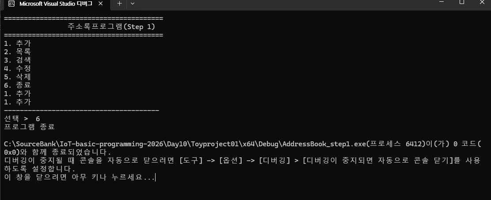
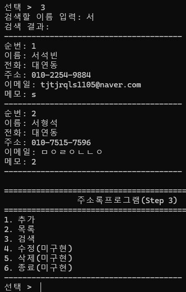

## 토이 프로젝트
### 주소록 프로그램
#### 개요
-C기본 학습 후 (구조체,배열,포인터,파일 IO, 문자열, 검색, 정렬등등) 활용 하는 묶음 프로젝트
- DB로 전환 하기전 가장 좋은 예제
-GUI는 추후에 가능

#### 목표

- 연락처 추가/목록/수정/삭제/검색
- 파일 저장/불러오기
- (추가)정렬/중복체크/cs 등으로 내보내기

#### 데이터 모델
- 이름,전화,이메일,주소,메모
- 구조체로 생성

### 스탭 1
- 콘솔 메뉴와 기본 뼈대만 동작

step1 결과 화면

### 스탭 2
- 구조체, 배열,추가/목록 구현

### 스텝 3
- 이름으로 검색
- 이름 부분 일치(김 -> 김철수,김민수 다 검색)
- 결과가 없으먄 안내 메세지

### 스텝 4

-연락처 수정, 삭제
- 삭제는 배열을 앞으로 당기는 처리를 추가 한다, count도 -1 감소

### 스탭 5
- 파일 저장/불러오기(영구 저장)
- 지금까지 계속 프로그램 종료 하면 데이터가 다 날아 갔음
 
 ### 스탭 6
 - 정렬, 중복 체크, 입력 검증

 ### 스텝 7
 -동적 배열, 대용량 저장

 ### 스텝 8